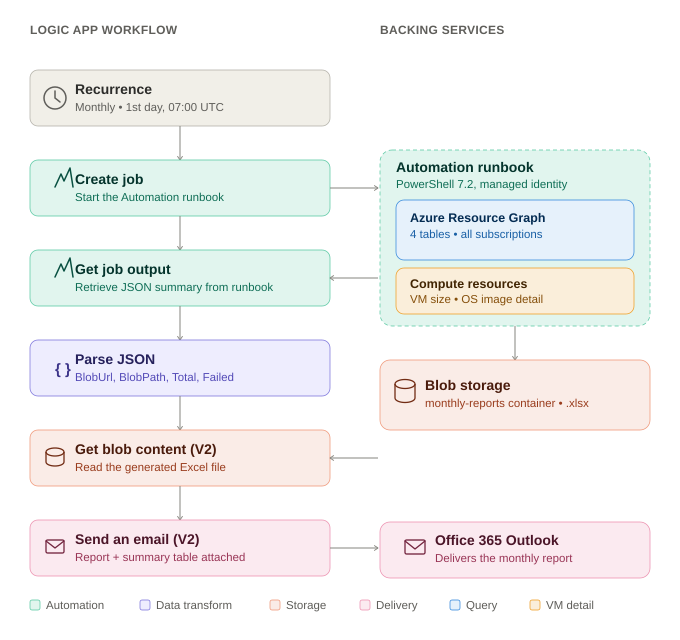

# Azure Update Manager – Monthly Patch Compliance Report

Fully automated, multi-subscription monthly patch compliance reporting for Azure Update Manager. An Azure Automation Runbook queries Azure Resource Graph across every subscription the identity can see, builds a color-coded Excel report, uploads it to Blob Storage, and a Logic App emails it out on a schedule — zero manual effort after setup.

---

## Architecture



**Logic App workflow (6 steps):**

```
Recurrence → Create job → Get job output → Parse JSON → Get blob content (V2) → Send an email (V2)
```

---

## Components Required

| Component | Purpose | Notes |
|---|---|---|
| **Azure Automation Account** | Hosts and runs the PowerShell runbook | Runtime version **7.2** required |
| **System-Assigned Managed Identity** (on Automation Account) | Authenticates to Resource Graph and Storage without stored credentials | Enabled under Automation Account → Identity |
| **Automation Runbook** | `Generate-MonthlyPatchReport.ps1` — queries patch data, builds Excel, uploads to blob | PowerShell 7.2 type |
| **Storage Account** | Hosts the generated Excel reports | Blob container: `monthly-reports` |
| **Logic App (Consumption)** | Orchestrates: trigger runbook → wait → fetch blob → email | System-Assigned Managed Identity enabled |
| **Office 365 Outlook connector** | Sends the report via email | Connected via Logic App Managed Identity or user sign-in |

### PowerShell Modules (Automation Account → Modules)

| Module | Type | Notes |
|---|---|---|
| `Az.Accounts` | **Built-in** | Do not override with a custom import — version conflicts with `Az.ResourceGraph` caused repeated failures. Left as the platform default (2.15.0 at time of writing). |
| `Az.Storage` | Built-in | Used for blob upload |
| `ImportExcel` | **Custom** (import from PowerShell Gallery) | No built-in equivalent; generates the `.xlsx` without needing Excel installed |

> **Note:** `Az.ResourceGraph` module was deliberately **avoided**. Every published version has a strict `Az.Accounts` minimum-version requirement that conflicted with the Automation sandbox's built-in version, causing "module found but could not be loaded" errors that couldn't be resolved without breaking other modules. The script instead calls the **Resource Graph REST API directly** via `Invoke-RestMethod`, which works with any `Az.Accounts` version since it only needs a bearer token.

---

## RBAC Requirements

### 1. Automation Account's Managed Identity

| Role | Scope | Purpose |
|---|---|---|
| **Reader** | Each subscription to be included in the report | Required for Resource Graph to query `maintenanceresources`, `patchassessmentresources`, `patchinstallationresources`, and `Microsoft.Compute/virtualMachines` in that subscription |
| **Storage Blob Data Contributor** | The target Storage Account | Required to upload the Excel report via OAuth (`New-AzStorageContext -UseConnectedAccount`) — avoids needing storage account keys entirely |

```powershell
$aaIdentity = (Get-AzAutomationAccount -ResourceGroupName "<rg>" -Name "<automation-account>").Identity.PrincipalId

# Reader on each subscription
New-AzRoleAssignment -ObjectId $aaIdentity -RoleDefinitionName "Reader" `
    -Scope "/subscriptions/<subscription-id>"

# Storage Blob Data Contributor on the report storage account
New-AzRoleAssignment -ObjectId $aaIdentity -RoleDefinitionName "Storage Blob Data Contributor" `
    -Scope "/subscriptions/<sub-id>/resourceGroups/<rg>/providers/Microsoft.Storage/storageAccounts/<storage-account>"
```

> For multi-subscription environments, consider assigning **Reader** at the **Management Group** level instead of per-subscription, if your governance model allows it — one role assignment covers all subscriptions underneath.

### 2. Logic App's Managed Identity

| Role | Scope | Purpose |
|---|---|---|
| **Automation Contributor** | The Automation Account (or its resource group) | Required for the "Create job" and "Get job output" actions to start and read the runbook |
| **Storage Blob Data Reader** | The target Storage Account | Required for "Get blob content (V2)" to read the generated Excel file |

```powershell
$laIdentity = (Get-AzLogicApp -ResourceGroupName "<rg>" -Name "<logic-app-name>").Identity.PrincipalId

New-AzRoleAssignment -ObjectId $laIdentity -RoleDefinitionName "Automation Contributor" `
    -Scope "/subscriptions/<sub-id>/resourceGroups/<automation-account-rg>"

New-AzRoleAssignment -ObjectId $laIdentity -RoleDefinitionName "Storage Blob Data Reader" `
    -Scope "/subscriptions/<sub-id>/resourceGroups/<rg>/providers/Microsoft.Storage/storageAccounts/<storage-account>"
```

### 3. Office 365 Outlook Connection

Uses a standard user sign-in (OAuth) via the Logic App connector — no separate RBAC role needed, just a valid mailbox with send permissions for the "From" account used in the connection.

---

## Data Sources (Azure Resource Graph Tables)

Azure Update Manager does **not** write to Log Analytics by default. All data for this report comes from Azure Resource Graph:

| Table | What It Provides |
|---|---|
| `maintenanceresources` (`type = microsoft.maintenance/applyupdates`) | Patch run status (Succeeded / Failed / TimedOut), start/end time, maintenance configuration ID |
| `patchinstallationresources` (`type = microsoft.compute/virtualmachines/patchinstallationresults`) | Actual installed/failed/excluded/pending patch counts, reboot status, generic OS type |
| `patchassessmentresources` (`type = microsoft.compute/virtualmachines/patchassessmentresults`) | Critical/security pending patch counts, last assessment time |
| `resources` (`type = microsoft.compute/virtualmachines`) | VM Size and OS image reference (used to build a friendly OS label like "Windows Server 2022 Datacenter") |

### Key implementation detail: joining across tables

Each of the above tables uses a different `id` suffix format (e.g. `.../virtualmachines/vm01/patchinstallationresults/<guid>`), and Resource Graph's KQL `split()` is **case-sensitive** while `arg_max(expr, *)` silently overwrites any column computed with `extend` before it. Both caused repeated join failures during development.

**Solution:** minimal KQL (`project` only, no string manipulation), then all ID normalization happens in PowerShell using a single case-insensitive regex helper:

```powershell
function Get-BaseVmId {
    param([string]$RawId)
    return ($RawId -replace '(?i)/(patchassessmentresults|patchinstallationresults)(/.*)?$', '').ToLower().TrimEnd('/')
}
```

Joins are then done via PowerShell hashtables (`$installLookup[$vmId]`) for O(1) lookups instead of repeated `Where-Object` filtering.

---

## Report Output

The generated Excel workbook (`AzureUpdateManager_PatchReport_<yyyy-MM>.xlsx`) contains:

| Sheet | Contents |
|---|---|
| **Detailed Report** | Every VM: name, resource group, subscription, OS type (detailed, e.g. "Windows Server 2022 Datacenter"), VM size, patch status (color-coded), patch counts, reboot status, maintenance window, duration |
| **Summary by Subscription** | Roll-up per subscription: total VMs, succeeded, timed out, failed, pending reboot, success % |
| **Needs Attention** | Filtered view: only Failed / Timed Out / Warnings / Pending Reboot VMs |
| **Pending Reboot** | Filtered view: only VMs awaiting reboot |

**Color coding** (via `Add-ConditionalFormatting`):
- 🟢 Green — Succeeded
- 🔴 Red — Failed
- 🟠 Orange — Timed Out / Warnings / Pending Reboot

---

## Setup Guide

### Step 1 — Create the Automation Account
```powershell
New-AzAutomationAccount -ResourceGroupName "<rg>" -Name "<aa-name>" -Location "<region>" `
    -AssignSystemIdentity
```

### Step 2 — Import required custom module
```powershell
New-AzAutomationModule -ResourceGroupName "<rg>" -AutomationAccountName "<aa-name>" `
    -Name "ImportExcel" `
    -ContentLinkUri "https://www.powershellgallery.com/api/v2/package/ImportExcel" `
    -RuntimeVersion "7.2"
```

### Step 3 — Assign RBAC to the Automation Account identity
See [RBAC Requirements](#rbac-requirements) above.

### Step 4 — Deploy the runbook
```powershell
Import-AzAutomationRunbook -ResourceGroupName "<rg>" -AutomationAccountName "<aa-name>" `
    -Name "Generate-MonthlyPatchReport" -Type PowerShell72 `
    -Path "./Generate-MonthlyPatchReport.ps1" -Force -Published
```

### Step 5 — Create Storage Account + container
```powershell
New-AzStorageAccount -ResourceGroupName "<rg>" -Name "<storage-account>" `
    -Location "<region>" -SkuName Standard_LRS -Kind StorageV2 `
    -AllowBlobPublicAccess $false -MinimumTlsVersion TLS1_2

$ctx = (Get-AzStorageAccount -ResourceGroupName "<rg>" -Name "<storage-account>").Context
New-AzStorageContainer -Name "monthly-reports" -Context $ctx -Permission Off
```

### Step 6 — Build the Logic App
Create a Consumption Logic App with:
1. **Recurrence** trigger — Monthly, 1st day, 07:00 UTC
2. **Azure Automation – Create job** — points to the runbook, Wait for Job = Yes. **Click "Show all" under Advanced parameters** and fill in **Runbook Parameter StorageAccount** and **Runbook Parameter StorageRG** — these are mandatory on the runbook (see [Configuration Notes](#configuration-notes)), and the job will fail immediately with `"Cannot process command because of one or more missing mandatory parameters"` if left blank.
3. **Azure Automation – Get job output** — Job ID from step 2
4. **Parse JSON** — Content = output of step 3, Schema matches the runbook's final JSON output (see script)
5. **Azure Blob Storage – Get blob content (V2)** — Blob = `BlobPath` from Parse JSON
6. **Office 365 Outlook – Send an email (V2)** — Attachment Content = `base64(body('Get_blob_content_(V2)'))`

Assign RBAC to the Logic App's identity per the [RBAC Requirements](#rbac-requirements) section, then **Publish**.

---

## Configuration Notes

- **No hardcoded environment values**: `StorageAccount` and `StorageRG` are **mandatory parameters** with no defaults — the script will not run without them. This keeps the script itself free of any tenant-specific names. Supply your values in one of two ways:
  1. **Runbook default values** (recommended for scheduled runs): Automation Account → Runbooks → `Generate-MonthlyPatchReport` → Parameters → set a default value for each so the Logic App's "Create job" step doesn't need to pass them explicitly.
  2. **Pass explicitly per job**: in the Logic App's "Create job" action, add `StorageAccount` and `StorageRG` under its parameters with your values.
- **Reporting period**: the script defaults to the **current calendar month** for testing (`AddMonths(0)`). For production, change line 36:
  ```powershell
  $startDate = (Get-Date -Year $now.Year -Month $now.Month -Day 1).AddMonths(-1)
  $endDate   = (Get-Date -Year $now.Year -Month $now.Month -Day 1).AddSeconds(-1)
  ```
  to report the **previous full month** instead.
- **Failed Patches showing 0 on a "Failed" status VM** is expected in some cases — Azure Update Manager's overall run `status` can be `Failed` for operational reasons (agent timeout, extension error) even when the patches that did get attempted installed successfully. The report still flags these VMs clearly via the `Patch Status` color coding and the `Needs Attention` sheet.

---

## Repository Structure

```
.
├── README.md                          # This file
└── Generate-MonthlyPatchReport.ps1    # Automation Runbook script
```


